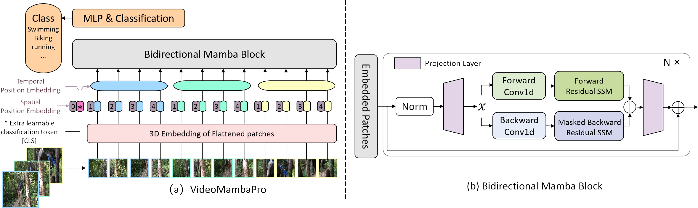

# VideoMambaPro
Official Implementation of [VideoMambaPro: A Leap Forward for Mamba in Video Understanding](https://arxiv.org/abs/2406.19006)


we investigate similarities and differences of self-attention and Mamba from the perspective of the latter, and reveal the limitations of Mamba on video understanding task. We propose VideoMambaPro that uses [VideoMamba](https://github.com/OpenGVLab/VideoMamba) as a backbone, but significantly enhancing performance in the video understanding task, narrowing the gap with transformers. 
# Installation

The required packages are in the file `requirements.txt`, and you can run the following command to install the environment

```
conda create -n videomambapro python=3.10
conda activate videomambapro

conda install cudatoolkit==11.8 -c nvidia
pip install torch==2.1.1 torchvision==0.16.1 torchaudio==2.1.1 --index-url https://download.pytorch.org/whl/cu118

conda install -c "nvidia/label/cuda-11.8.0" cuda-nvcc
conda install packaging

pip install causal_conv1d==1.4.0 (we recommend to install through .whl file)
pip install mamba-ssm
pip install -r requirements.txt
```

# Data Preparation
We read and process the same way as [VideoMAE](https://github.com/MCG-NJU/VideoMAE/blob/main/DATASET.md), but with a different convention for the format of the data list file. 


## Pre-train Dataset
We pretrain the model on ImageNet-1K dataset, where the model loads a data list file with the following format:
> frame_folder_path total_frames label

## Fine-tune Dataset
There are two implementations of our finetune dataset `VideoClsDataset` and `RawFrameClsDataset`, supporting video data and rawframes data, respectively. Where SSV2 uses `RawFrameClsDataset` by default and the rest of the datasets use `VideoClsDataset`.

`VideoClsDataset` loads a data list file with the following format:
> video_path label

while `RawFrameClsDataset` loads a data list file with the following format:
> frame_folder_path total_frames label

For example, video data list and rawframes data list are shown below:
```
# The path prefix 'your_path' can be specified by `--data_root ${PATH_PREFIX}` in scripts when training or inferencing.

# k400 video data validation list
your_path/k400/jf7RDuUTrsQ.mp4 325
your_path/k400/JTlatknwOrY.mp4 233
your_path/k400/NUG7kwJ-614.mp4 103
your_path/k400/y9r115bgfNk.mp4 320
your_path/k400/ZnIDviwA8CE.mp4 244
...

# ssv2 rawframes data validation list
your_path/SomethingV2/frames/74225 62 140
your_path/SomethingV2/frames/116154 51 127
your_path/SomethingV2/frames/198186 47 173
your_path/SomethingV2/frames/137878 29 99
your_path/SomethingV2/frames/151151 31 166
...
```
# Codes details
Our project is based on VideoMamba for fair comparison. To solve limitation 1&2 in our paper, we mainly change the pipeline of Mamba by applying the diagonal mask during the backward SSM and applying residual connection on the bidirection SSM.
The  residual connection of Ab is realized in function selective_scan_ref in mamba/mamba_ssm/ops/selective_scan_interface.py, and the key option is below:
```
x = u[:, :, 0].unsqueeze(-1).expand(-1, -1, dstate)
x = deltaA[:, :, i] * x + deltaB_u[:, :, i]
```
The mask assignment is realized through setting two selective functions, namely selective_scan_ref, and selective_scan_ref_sub in mamba/mamba_ssm/ops/selective_scan_interface.py.
When computing the bidirectional mamba, e.g., in bimamba_inner_ref of mamba/mamba_ssm/ops/selective_scan_interface.py, the key code is below:
```
y = selective_scan_fn(x, delta, A, B, C, D, z=z, delta_bias=delta_bias, delta_softplus=True)
y_b = selective_scan_ref_sub(x.flip([-1]), delta.flip([-1]), A_b, B.flip([-1]), C.flip([-1]), D, z.flip([-1]), delta_bias, delta_softplus=True)
y = y + y_b.flip([-1])
```

# Work Plans
1. release the model weights
2. release the results on Imagenet-1K
